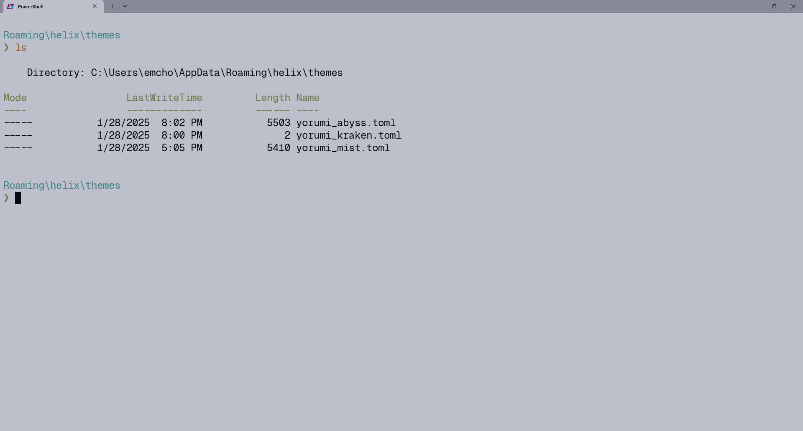

# Yorumi themes for Windows Terminal

|  |  |
| --- | --- |
| yorumi abyss | yorumi mist |
|  |  |
| yorumi shade | yorumi kraken |


### Installation

To set up your favourite theme, open the folder of Yorumi `Flavour` and copy the contents to the `schemes` section in the `settings.json` file of Windows Terminal. 

Launch Windows Terminal, open the Settings panel (Ctrl + ,), and select **Open JSON file** at the bottom left corner (Ctrl + Shift + ,). Then, choose your flavour (abyss, mist, shade, kraken) and copy the contents of the corresponding `yorumi-[flavour].json` into the `"schemes"` section of the JSON file. Similarly, copy the contents of the corresponding `yorumi-[flavour]-theme.json` into the `"themes"` section.

```json
{
  "schemes": [
    // yorumi-[Options: abyss | mist | shade | kraken].json
  ],
  "themes": [
    // yorumi-[Options: abyss | mist | shade | kraken ]-theme.json
  ]
}
```

### Applying the theme

After updating the `settings.json` file, save and exit. In the Settings panel, under **Profiles**, select the profile you want to apply the theme to (or choose **Defaults** to apply it to all profiles). Then, go to **Appearance** and select your desired Yorumi flavour from the **Color scheme** dropdown menu. Click **Save**, and enjoy your new colorscheme.
